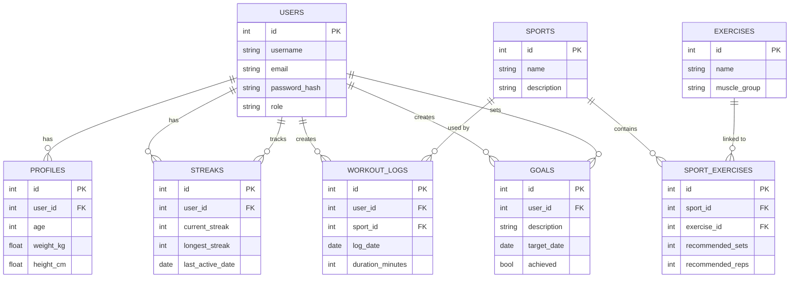

# Sports Watch Backend

A Flask backend API for tracking sports, workouts, and personal goals with JWT authentication and SQLAlchemy models.

## Overview

This backend provides user registration/login, sport and exercise management, workout log tracking, and goal management. It is built with:

- Flask
- Flask-SQLAlchemy
- Flask-Migrate
- Flask-JWT-Extended
- Flask-CORS
- SQLite by default (configurable via `DATABASE_URI`)

## Features

- Register and authenticate users via JWT
- Role-based access control for admin-only operations
- CRUD operations for sports and exercises
- User-specific workout log storage with pagination
- User goals tracking
- SQLAlchemy models and relationships for core entities
- Database migrations managed by Flask-Migrate

## Requirements

- Python 3.11+ (or compatible Python 3.x)
- PostgreSQL (default), or another database supported by SQLAlchemy

## Install

```bash
cd /home/clyde/development/module_five/projects/sports-watch-backend
python3 -m venv venv
source venv/bin/activate
pip install -r requirements.txt
```

## Environment Variables

Create a `.env` file in the project root or set these variables in your environment.

```env
DATABASE_URI=sqlite:///instance/sports_watch.db
JWT_SECRET_KEY=your_jwt_secret
SECRET_KEY=your_secret_key
```

If you want to use PostgreSQL instead, set:

```env
DATABASE_URI=postgresql://localhost/sports_watch
```

## Running the App

### Option 1: Run directly

```bash
python main.py
```

### Option 2: Use Flask CLI

```bash
export FLASK_APP=main.py
export FLASK_ENV=development
flask run
```

## Database Migrations

This project uses Flask-Migrate (Alembic) for schema migrations.

```bash
export FLASK_APP=main.py
flask db init          # only if migrations are not initialized yet
flask db migrate -m "Create initial schema"
flask db upgrade
```

## Authentication

- `POST /register` registers a new user and returns an access token
- `POST /login` logs in an existing user and returns an access token
- Protected routes require `Authorization: Bearer <access_token>`
- Admin-only routes require the JWT claim `role: admin`

## API Endpoints

### Auth

- `POST /register`
  - Body: `{ "username": "string", "email": "string", "password": "string", "role": "user" }`
  - Response: `201` with `{ user, access_token }`

- `POST /login`
  - Body: `{ "email": "string", "password": "string" }`
  - Response: `200` with `{ user, access_token }`

### Sports

- `GET /sports`
  - Public: returns all sports
  - Response: `200` with list of sport objects

- `POST /sports`
  - Admin only
  - Body: `{ "name": "string", "description": "string" }`
  - Response: `201` with created sport

- `DELETE /sports/<id>`
  - Admin only
  - Response: `204` on success

### Exercises

- `GET /exercises`
  - Public: returns all exercises
  - Response: `200` with list of exercise objects

- `POST /exercises`
  - Admin only
  - Body: `{ "name": "string", "muscle_group": "string" }`
  - Response: `201` with created exercise

### Workout Logs

- `GET /workout-logs`
  - JWT required
  - Query params: `page`, `per_page`
  - Response: `200` with paginated logs for current user

- `POST /workout-logs`
  - JWT required
  - Body: `{ "sport_id": int, "log_date": "YYYY-MM-DD", "duration_minutes": int }`
  - Response: `201` with created log

- `PATCH /workout-logs/<id>`
  - JWT required
  - Body may include any of: `sport_id`, `log_date`, `duration_minutes`
  - Response: `200` with updated log

- `DELETE /workout-logs/<id>`
  - JWT required
  - Response: `204` on success

### Goals

- `GET /goals`
  - JWT required
  - Response: `200` with goals for current user

- `POST /goals`
  - JWT required
  - Body: `{ "description": "string", "target_date": "YYYY-MM-DD" }`
  - Response: `201` with created goal

## Data Models



- `User`
  - `id`, `username`, `email`, `password_hash`, `role`
  - relationships: `profile`, `streak`, `workout_logs`, `goals`

- `Profile`
  - `id`, `user_id`, `age`, `weight_kg`, `height_cm`

- `Sport`
  - `id`, `name`, `description`
  - relationships: `workout_logs`, `sport_exercises`

- `Exercise`
  - `id`, `name`, `muscle_group`
  - relationship: `sport_exercises`

- `WorkoutLog`
  - `id`, `user_id`, `sport_id`, `log_date`, `duration_minutes`
  - relationships: `user`, `sport`

- `Goal`
  - `id`, `user_id`, `description`, `target_date`, `achieved`
  - relationship: `user`

- `Streak` and `SportExercise` are part of the model schema and support related user progress and sport/exercise mappings.

## Project Structure

- `main.py` — Flask application and route definitions
- `config.py` — application configuration and environment variables
- `extensions.py` — shared Flask extensions (`db`, `jwt`)
- `controllers/` — business logic for auth, sports, exercises, workout logs, and goals
- `models/` — SQLAlchemy ORM models
- `migrations/` — Alembic database migration files
- `requirements.txt` — pinned dependencies

## Notes

- The app uses `python-dotenv` to load environment variables from a `.env` file.
- Admin-only endpoints are enforced by `middleware.admin_required`.
- User-specific resources are validated against the JWT identity.

## Quick Commands

```bash
source venv/bin/activate
export FLASK_APP=main.py
flask db upgrade
python main.py
```

If you want, I can also generate a matching frontend README for the client folder. }
