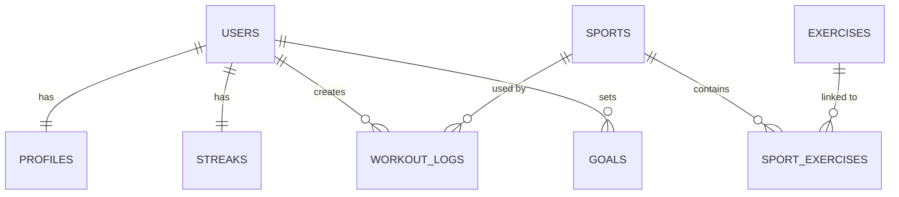

cat > README.md << 'EOF'
# Sports Watch Backend

A Flask backend API for tracking sports, workouts, and personal goals with JWT authentication and SQLAlchemy models.

## Overview

This backend provides user registration/login, sport and exercise management, workout log tracking, and goal management. It is built with:

- Flask
- Flask-SQLAlchemy
- Flask-Migrate
- Flask-JWT-Extended
- Flask-CORS
- PostgreSQL by default (configurable via `DATABASE_URI`)

## Features

- Register and authenticate users via JWT
- Role-based access control for admin-only operations
- CRUD operations for sports and exercises
- User-specific workout log storage with pagination
- User goals tracking
- SQLAlchemy models and relationships for core entities
- Database migrations managed by Flask-Migrate

## Requirements

- Python 3.11+ (or compatible Python 3.x)
- PostgreSQL

## Install

```bash
python3 -m venv venv
source venv/bin/activate
pip install -r requirements.txt
```

## Environment Variables

Create a `.env` file in the project root:

```env
DATABASE_URI=postgresql:///sports_watch
JWT_SECRET_KEY=your_jwt_secret
SECRET_KEY=your_secret_key
```

> **Security note:** never commit real secrets to version control. Generate strong random values for `JWT_SECRET_KEY` and `SECRET_KEY` (e.g. `python -c "import secrets; print(secrets.token_hex(32))"`) and make sure `.env` is listed in `.gitignore`.

## Running the App

```bash
export FLASK_APP=main.py
flask run
```

## Database Migrations

```bash
export FLASK_APP=main.py
flask db upgrade
python seed.py
```

## Authentication

- `POST /register` registers a new user and returns an access token
- `POST /login` logs in an existing user and returns an access token
- Protected routes require `Authorization: Bearer <access_token>`
- Admin-only routes require the JWT claim `role: admin`

## API Endpoints

### Auth
- `POST /register` — `{ username, email, password }` → `201` with `{ user, access_token }`
- `POST /login` — `{ email, password }` → `200` with `{ user, access_token }`

### Sports
- `GET /sports` — public, list all sports
- `POST /sports` — admin only
- `DELETE /sports/<id>` — admin only

### Exercises
- `GET /exercises` — public, list all exercises
- `POST /exercises` — admin only

### Workout Logs
- `GET /workout-logs?page=&per_page=` — JWT required, paginated, own logs only
- `POST /workout-logs` — JWT required
- `PATCH /workout-logs/<id>` — JWT required, own logs only
- `DELETE /workout-logs/<id>` — JWT required, own logs only

### Goals
- `GET /goals` — JWT required
- `POST /goals` — JWT required

## Data Model



See `docs/erd.mmd` for the full diagram with all columns.

## Project Structure

- `main.py` — Flask application and route definitions
- `config.py` — application configuration and environment variables
- `extensions.py` — shared Flask extensions (`db`, `jwt`)
- `middleware.py` — `admin_required` route guard
- `controllers/` — business logic for auth, sports, exercises, workout logs, and goals
- `models/` — SQLAlchemy ORM models
- `migrations/` — Alembic database migration files
- `client/` — React (Vite) frontend
- `seed.py` — populates the database with sample data
- `requirements.txt` — pinned dependencies

## Quick Commands

```bash
source venv/bin/activate
export FLASK_APP=main.py
flask db upgrade
flask run
```
EOF

git add README.md
git rebase --continue